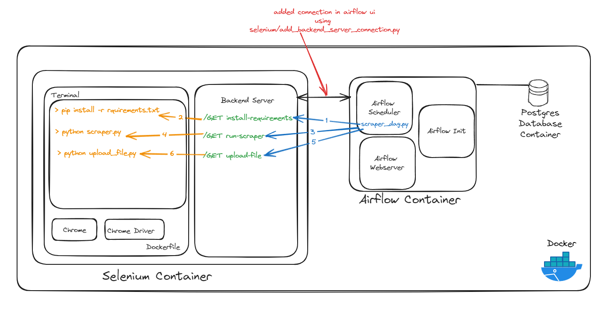

# Airflow with Selenium Integration
This project provides a complete setup for Apache Airflow integrated with Selenium, allowing users to schedule and run jobs that require browser automation. It leverages Docker Compose to simplify the deployment and management of all necessary services.

# Architecture



# Features
- Airflow: Automate workflows and manage ETL processes.
- PostgreSQL: Reliable database backend for Airflow.
- Selenium: Browser automation for scraping or testing purposes.
- Docker Compose: Easy orchestration of all services.

# Project Structure

```sh
├── dags
│   └── scraper_dag.py                    # Airflow DAG for scraper tasks
├── media
│   └── architecture.png                  # Diagram of the project architecture
├── scripts
│   ├── requirements.txt                  # Python dependencies for the scripts
│   ├── scraper.py                        # Script for scraping tasks
│   └── upload_file.py                    # Script for uploading files
├── selenium
│   ├── Dockerfile                        # Dockerfile for building the Selenium service
│   ├── add_backend_server_connection.py  # Script to add backend server connection in Airflow
│   ├── backend_server.py                 # Custom backend server script for Selenium
│   └── keep_alive.sh                     # Script to keep the Selenium service alive
├── .env                                  # Environment variables for the project
├── docker-compose.yml                    # Docker Compose file for orchestrating services
└── README.md                             # Project description and instructions

```

# Services

- PostgreSQL: A relational database to store Airflow metadata.
- Airflow Webserver: The web interface for managing and monitoring workflows.
- Airflow Scheduler: Schedules the workflows to run.
- Airflow Init: Initializes the Airflow database and creates an admin user.
- Selenium Chrome: A Selenium service with Chrome for running browser automation tasks.

# Environment Variables
- AIRFLOW_UID: User ID for Airflow (default: 50000)
- AIRFLOW_GID: Group ID for Airflow (default: 50000)
- _PIP_ADDITIONAL_REQUIREMENTS: Additional Python packages to install in Airflow

# Getting Started

1. Clone the repository

```sh
git clone https://github.com/yourusername/airflow-selenium.git
cd airflow-selenium
```

2. Make sure you replace files in `scripts` folder with your own scripts `scraper.py` and `requirements.txt`. 

3. Create `.env` file and add following variables

```sh
AIRFLOW_UID=502
AIRFLOW_GID=0
```

4. Build and Start Services
```sh
docker-compose up --build
```

5. Access Airflow

Open your browser and navigate to `http://localhost:8080`. Use the credentials `admin/admin` to log in.

# Scheduling Selenium Jobs

You can schedule Selenium-based tasks within Airflow by creating DAGs that leverage the Selenium service. Here's a simple example:


```python
from airflow import DAG
from airflow.operators.python_operator import PythonOperator
from datetime import datetime
from selenium import webdriver

def selenium_task():
    options = webdriver.ChromeOptions()
    options.add_argument("--no-sandbox")
    driver = webdriver.Remote(
        command_executor='http://selenium-chrome:4444/wd/hub',
        options=options
    )
    driver.get("http://example.com")
    print(driver.title)
    driver.quit()

default_args = {
    'owner': 'airflow',
    'start_date': datetime(2023, 1, 1),
}

dag = DAG('selenium_example', default_args=default_args, schedule_interval='@daily')

t1 = PythonOperator(
    task_id='selenium_task',
    python_callable=selenium_task,
    dag=dag,
)

```

# Contributing

Contributions are welcome! Feel free to submit a pull request or open an issue if you have any suggestions or bug reports.

# License

This project is licensed under the MIT License. See the LICENSE file for more details.